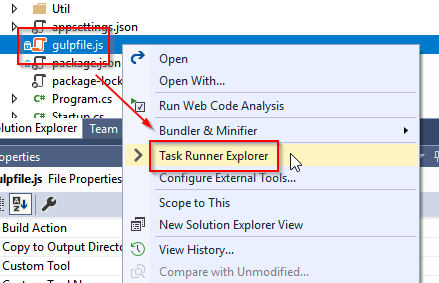
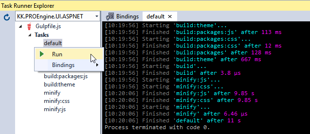

## Theme 

The theme folder contains the the site-specific css.

Most of it is borrowed from bootswatch, Litera:

https://bootswatch.com/litera/

### Files

<dl>
  <dt>_site_variables.scss</dt>
  <dd>Color definitions, borders, shadows, etc.</dd>

  <dt>_site.scss</dt>
  <dd>Site-specific style customizations</dd>

  <dt>_variables.cscc</dt>
  <dd>Bootswatch variables - <b>do not edit this file</b></dd>

  <dt>_bootswatch.scss</dt>
  <dd>Bootswatch theme style - <b>do not edit this file</b></dd>

  <dt>build.scss</dt>
  <dd>Main file - including all the other scss files (including bootstrap)</dd>

  <dt>../gulpfile.js</dt>
  <dd>Theme build script (gulp)</dd>
</dl>

### Build

Use the Visual Studio "Task Runner Explorer" to convert the scss-files to css:

- Rightclick ../gulpfile.js
- Select "Task Runner Explorer"
  
- In the "Tasks" list run the "default" task
  

This will build and minify everything (packages and theme).

To build the theme only run the "build:theme" task.

### Notes

If you are having trouble reading this file, try viewing it in VSTS:

https://kkwindsolutions.visualstudio.com/_git/PRO%20Engine?path=%2FKK.PROEngine.UI.ASPNET%2FTheme%2FREADME.md&version=GBdevelop&_a=preview

